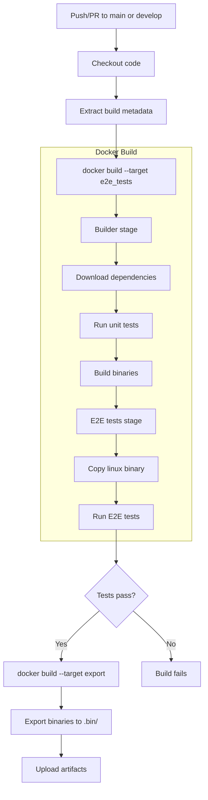

# CLI Tool Build Example

> **Maturity Level**: Emerging - Demonstration project for containerized Go build workflows

A demonstration of building and testing a Go CLI application entirely within Docker containers.

## Why containerized builds?

The short answer: portability and consistency.

When your build logic lives in a Dockerfile and shell scripts, your CI
configuration becomes almost trivial. It's essentially "checkout code, run
docker build, upload artifacts." Switching from GitHub Actions to GitLab CI to
Azure DevOps? You're not rewriting platform-specific build steps each time.
The CI platform just orchestrates - it doesn't own your build process.

This also means developers run the exact same build locally as CI does. No more
debugging why something works in CI but fails on your machine, or vice versa.
The build environment is defined in the Dockerfile, not dependent on whatever
tools happen to be installed on the runner or your laptop.

The build logic stays in files you control (Dockerfile, Makefile, scripts)
rather than scattered across CI-specific YAML. That's less lock-in and more
flexibility when your needs inevitably change.

## Usage

Build all platform binaries with a single command:

```bash
make build
```

Binaries are output to `.bin/amd64/{darwin,linux,windows}/`.

## How it works

The build process runs entirely in Docker using a multi-stage Dockerfile:

1. **Builder stage**: Compiles Go binaries for darwin, linux, and windows (amd64). Runs unit tests before compilation.
2. **E2E tests stage**: Copies the linux binary and runs end-to-end tests against it inside the container.
3. **Export stage**: Exports all binaries to the host filesystem.

The build script (`build/build.sh`) orchestrates this by running the e2e_tests target first. If tests pass, it proceeds to the export target. This ensures binaries are only exported after verification.

Version information (version, build date, git commit) is embedded into binaries
via ldflags during compilation.

## CI Build Flow

The following diagram shows the CI pipeline triggered by GitHub Actions:



## Key Considerations

- E2E tests run against the linux binary only, since tests execute inside the container
- Unit tests run during the build stage before binary compilation
- All binaries are built for amd64 architecture
- The E2E tests module (`tests/e2e/`) is separate from the main module to keep test dependencies isolated

## Development Considerations

### Quick Start

```bash
make build
```

This builds all binaries and runs both unit and E2E tests.

### Building and running

The Makefile wraps the build script with proper version metadata:

```bash
# Build with automatic version detection from git tags
make build

# Or run the build script directly with custom values
BUILD_VER=v1.0.0 BUILD_DATE=2025-01-01 BUILD_COMMIT=abc12345 ./build/build.sh
```

### Testing

Tests are integrated into the Docker build:

- **Unit tests**: Run in the builder stage via `go test`
- **E2E tests**: Run in a separate stage against the compiled linux binary

The build fails fast if any tests fail.

### Versioning

This project uses git tag-based versioning. The build process extracts:

- Version from `git describe --tags`
- Build date from the current date
- Commit hash from `git rev-parse`

These values are embedded into binaries and displayed via the `version` command.

### CI/CD

GitHub Actions runs the build on pushes and pull requests to main and develop branches. Artifacts are uploaded and retained for 30 days.

### Prerequisites

- Docker 20.10+ - [Installation instructions](https://docs.docker.com/get-docker/)
- GNU Make 3.81+
- Git (for version metadata)
